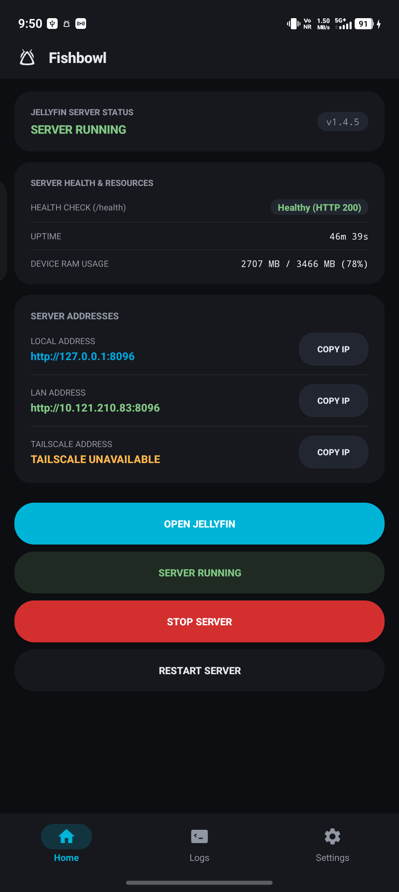
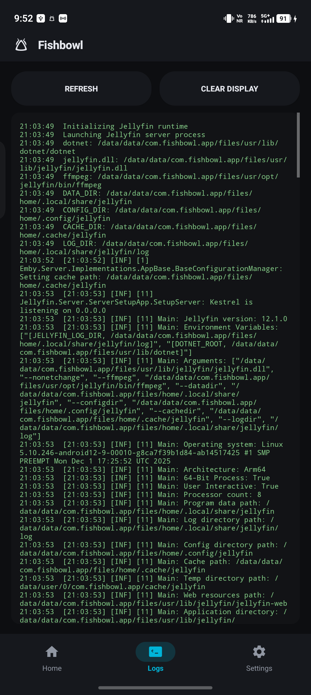
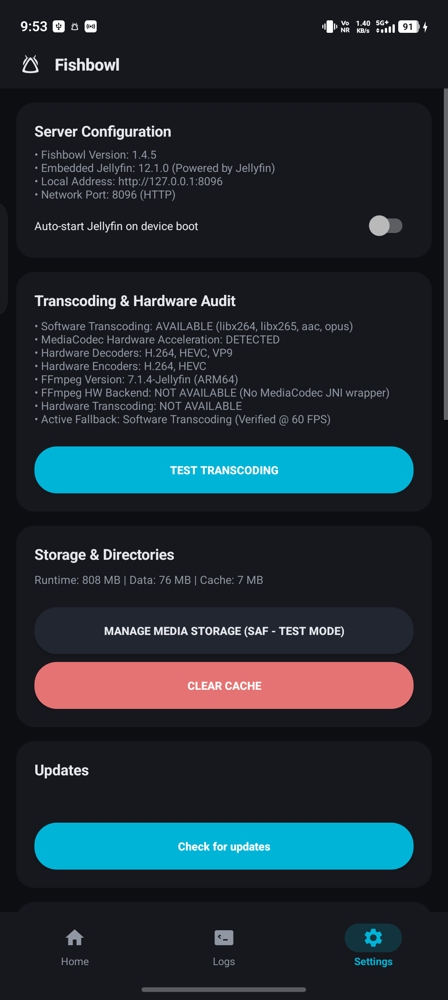

# Fishbowl

An unofficial standalone server host and launcher for Jellyfin on Android (ARM64).

[](https://github.com/Suz41/Fishbowl/releases/tag/v1.4.5)
[](https://jellyfin.org)
[](https://dotnet.microsoft.com)
[-3DDC84.svg?logo=android&logoColor=white)](https://android.com)
[](LICENSE.md)
[-success.svg)](#permissions--privacy)

> [!IMPORTANT]
> **Disclaimer & Community Notice:**
> Fishbowl is an independent, unofficial community project and is **not affiliated with, maintained by, or endorsed by the official Jellyfin project or its core developers**. This project was built using an independent vibe-coding workflow with agentic AI assistants.
> - **Upstream Protection:** **Please do not contact, bother, or submit bug reports to the official Jellyfin developers, forums, or issue trackers for issues with Fishbowl.** All bug reports and questions must be directed exclusively to this repository's [GitHub Issues](https://github.com/Suz41/Fishbowl/issues).
> - **Security, Transparency & Voluntary Use:** Nobody is forced or pressured to download or install this application. We recognize that because this is a vibe-coded project, security-conscious users may have questions or concerns. The entire project is 100% open-source with full transparency, zero trackers, and zero telemetry. You are freely welcome and encouraged to inspect, decompile, audit the code and network traffic, or test the APK in an isolated environment.

Fishbowl runs the full **Jellyfin Media Server (v12.1.0)** natively on your Android device (**ARM64**). It transforms any spare Android phone, tablet, or TV box into a dedicated, low-power home streaming server without requiring root access, Docker, or external PC hardware.

---

## Quick Start (3 Steps)

1. **Download & Install:**
   Grab the latest [Fishbowl-v1.4.5-release-universal.apk](https://github.com/Suz41/Fishbowl/releases/tag/v1.4.5) and install it on your ARM64 Android device.
2. **Launch & Start:**
   Open **Fishbowl**. The server auto-starts in the background. When the status badge turns green (**SERVER RUNNING**), tap **OPEN JELLYFIN**.
3. **Connect & Stream:**
   Connect any official Jellyfin client (TV, phone, browser) on your Wi-Fi using the **LAN Address** displayed on your home screen (e.g. `http://192.168.1.xxx:8096`).

---

## Preview & Interface

<p align="center">
  
  &nbsp;
  
  &nbsp;
  
</p>

---

## Table of Contents

- [Quick Start (3 Steps)](#quick-start-3-steps)
- [Key Features](#key-features)
- [Client Compatibility](#client-compatibility)
- [Storage & Media Setup](#storage--media-setup)
- [Background Resilience](#background-resilience)
- [System Architecture](#system-architecture)
- [Permissions & Privacy](#permissions--privacy)
- [Directory Structure](#directory-structure)
- [Building From Source](#building-from-source)
- [Troubleshooting & FAQ](#troubleshooting--faq)
- [Disclosures & License](#disclosures--license)

---

## Key Features

### Server Engine
- **Jellyfin 12.1.0 Core:** Direct POSIX execution on Android Bionic C runtime (`libc.so`) without virtualization or containers.
- **Embedded .NET 10 Host:** High-throughput JIT execution powered by Microsoft .NET 10.0.12 (Linux Bionic ARM64).
- **Jellyfin-FFmpeg Engine:** Native mobile FFmpeg binary supporting on-the-fly transcoding, audio remuxing, and HLS streaming.
- **SQLite3 Database Engine:** Local low-latency database storage (`libe_sqlite3.so`) for library indexes, user states, and metadata.
- **Port Conflict & Health Guard:** Pre-flight socket inspection and strict verification of public Jellyfin system endpoints (`/system/info/public` and `/health`) to prevent false-positive reconciles and Emby port 8096 collisions.

### User Interface
- **Interactive Setup & Extraction Overlay:** Dedicated onboarding overlay with real-time percentage progress (0% to 100%), five-stage checklist, and live log stream during initial runtime extraction or reinstallations.
- **Zero-Crash Resilient Architecture:** Pre-cached tab navigation (Home, Logs, Settings) eliminates fragment recreation crashes and state loss.
- **Throttled Log Queue:** Thread-safe UI log buffer eliminates main thread looper congestion and ANRs during high-volume server operations.
- **Safe Background Minimization:** Back-press safely moves application to background (`moveTaskToBack`) without terminating or restarting the active server session.
- **Automatic Auto-Start:** Server lifecycle begins immediately on app launch without manual intervention.
- **Material 3 Pixel UI:** OLED pure dark mode (`#121316`) with tactile spring animations on all touch targets.
- **Live Lifecycle Pipeline:** Step-by-step progress tracking (`STARTING_RUNTIME` -> `LAUNCHING_SERVER` -> `WAITING_FOR_SERVER` -> `READY`).
- **Network Address Hub:** Instant local loopback, Wi-Fi LAN IP, and Tailscale VPN CGNAT (`100.x.x.x`) IP resolution with locked display and one-tap `COPY IP` buttons.
- **Dedicated Diagnostics:** Real-time software and hardware transcoding test suite in Settings.

---

## Client Compatibility

Stream to any standard Jellyfin client across your local network:

| Client App | Platforms | Playback Capabilities |
| :--- | :--- | :--- |
| **Jellyfin Android TV** | Google TV, FireStick, Shield TV, Mi Box | 4K HDR, HEVC, Dolby Vision, Direct Play |
| **Jellyfin Mobile** | Android Smartphones & Tablets | Gestures, Background Audio, Casting |
| **Jellyfin iOS** | iPhone, iPad | Native Player, HLS Streaming, AirPlay |
| **Web Browser** | Chrome, Firefox, Safari, Edge, Brave | HTML5 Player, Administrative Dashboard |
| **Roku Client** | Roku Streaming Sticks, Roku Smart TVs | Direct Play, Remuxing |
| **Swiftfin & Infuse** | Apple TV, macOS, iOS | Native Metal Decoding, Subtitle Sync |
| **Kodi Integration** | Windows, Linux, LibreELEC, Raspberry Pi | Jellyfin for Kodi Addon / Direct Path |

---

## Storage & Media Setup

Jellyfin runs as a native Linux process (`dotnet jellyfin.dll`) and requires standard POSIX paths (`/storage/...`) to index and stream media.

### Option 1: Internal Storage (Recommended)
Grant **All-Files Access** when prompted. You can immediately point Jellyfin libraries to your standard internal folders:
- `/storage/emulated/0/Movies`
- `/storage/emulated/0/Music`
- `/storage/emulated/0/Download`

### Option 2: USB OTG & MicroSD Drives (Guaranteed POSIX)
Due to Android SELinux boundaries on Android 11 through 16, non-root Linux binaries cannot read the raw root of external drives. Fishbowl automatically detects your plugged-in USB drive and exposes the guaranteed app directory:
- `/storage/<UUID>/Android/data/com.fishbowl.app/files`

**How to use USB media:**
1. Move your movies/music into the path above on your USB drive.
2. In Fishbowl, go to **Settings ➔ Manage Media Storage**.
3. Tap **COPY PATH** next to your USB drive.
4. Paste the path into the Jellyfin Web UI when adding your media library.

### Option 3: SAF Folder Bridge [TEST MODE]
- Includes an experimental Storage Access Framework (SAF) folder picker.
- **Virtual Cloud Providers (RSAF, Google Drive, Nextcloud):** Quarantined with an incompatibility warning because virtual network streams do not have Linux disk mount points and cannot be read by native server binaries.

---

## Background Resilience

- **Foreground Service:** Runs `JellyfinServerService` with `foregroundServiceType="mediaPlayback"` and ongoing notification (ID `1001`) to protect the process from OS memory management.
- **CPU WakeLock:** Maintains an active `PARTIAL_WAKE_LOCK` with auto-timeout safeguards so media streaming continues with the screen turned off.
- **Battery Optimization Exemption:** Prompts for battery unrestricted mode to prevent OEM task killers (Vivo, Xiaomi, Samsung, Huawei) from terminating the background server.
- **State Hydration:** Asynchronously syncs server lifecycle state instantly on app resume.

---

## System Architecture

```
+-------------------------------------------------------------------------+
|                           Android User Space                            |
|                                                                         |
|  +-------------------------------------------------------------------+  |
|  |                     Fishbowl UI Shell                           |  |
|  |   JellyfinDroidActivity (3-Tab Pixel UI / Home / Logs / Settings)  |  |
|  |   JellyfinWebActivity   (Hardware-Accelerated WebView Client)     |  |
|  |   JellyfinStorageActivity (SAF Document Tree File Bridge)         |  |
|  +-------------------------------------------------------------------+  |
|                                  |                                      |
|  +-------------------------------------------------------------------+  |
|  |                    Lifecycle & Service Layer                      |  |
|  |   JellyfinController    (State Machine: STARTING -> READY)        |  |
|  |   JellyfinServerService (Foreground Service / Ongoing Notification)| |
|  |   JellyfinBootstrapper  (Asset Extraction & Dynamic DNS Setup)    |  |
|  +-------------------------------------------------------------------+  |
|                                  |                                      |
|  +-------------------------------------------------------------------+  |
|  |                     Native Subsystem (POSIX)                      |  |
|  |   .NET 10 Host (dotnet) ---> Jellyfin.Server.dll (12.1.0)         |  |
|  |   Jellyfin-FFmpeg Engine ---> Hardware Transcoding / HLS Remux     |  |
|  |   libe_sqlite3.so Engine ---> Database Storage (~/.local/share)   |  |
|  |   libfontconfig / libfreetype ---> Subtitle Burn-In Engine        |  |
|  +-------------------------------------------------------------------+  |
|                                                                         |
+-------------------------------------------------------------------------+
```

---

## Permissions & Privacy

Fishbowl operates entirely within standard Android OS sandboxing rules:

| Permission | Purpose |
| :--- | :--- |
| `FOREGROUND_SERVICE` | Keeps server process active in background |
| `FOREGROUND_SERVICE_MEDIA_PLAYBACK` | Android 14+ background media streaming classification |
| `WAKE_LOCK` | Prevents CPU sleep during playback when screen is off |
| `INTERNET` & `ACCESS_NETWORK_STATE` | Manages LAN and local socket connections |
| `MANAGE_EXTERNAL_STORAGE` | Grants access to local movie and music files |

**Privacy Guarantee:**
- 0 Remote Trackers
- 0 Analytics SDKs
- 0 Telemetry Sockets
- 100% Local Processing

---

## Directory Structure

All persistent server state is stored within the application sandboxed directory:

| Type | Path | Description |
| :--- | :--- | :--- |
| **System Prefix** | `/data/data/com.fishbowl.app/files/usr` | Native binaries, Dotnet runtime, and libraries |
| **Data (`--datadir`)** | `/data/data/com.fishbowl.app/files/home/.local/share/jellyfin` | Database (`jellyfin.db`), accounts, and watch history (preserved across updates) |
| **Config (`--configdir`)** | `/data/data/com.fishbowl.app/files/home/.config/jellyfin` | Server XML configuration (`system.xml`, `network.xml`) |
| **Cache (`--cachedir`)** | `/data/data/com.fishbowl.app/files/home/.cache/jellyfin` | Image thumbnails and transcode buffers |
| **Logs (`--logdir`)** | `/data/data/com.fishbowl.app/files/home/.local/share/jellyfin/log` | Native server logs |

---

## Building From Source

### Prerequisites
- Windows 10/11, macOS, or Linux
- OpenJDK 17 or OpenJDK 21
- Android SDK (API 28+) and NDK (r25+)
- Gradle (wrapper included)

### Build Commands
```bash
# Clone the repository
git clone https://github.com/Suz41/Fishbowl.git
cd Fishbowl

# Build Debug APK
./gradlew assembleDebug

# Build Universal Release APK
./gradlew assembleRelease
```
Generated APKs will be located in `app/build/outputs/apk/release/` and `app/build/outputs/apk/debug/`.

---

## Troubleshooting & FAQ

#### Q: Server stops when I lock my phone or switch apps?
**A:** Set battery optimization to **Unrestricted** in Android Settings (`Apps ➔ Fishbowl ➔ Battery ➔ Unrestricted`). OEM skins (MIUI, HyperOS, OriginOS, OneUI) may terminate background tasks aggressively if this is not set.

#### Q: How do I access Jellyfin from other devices on my network?
**A:** Open Fishbowl, copy the **LAN Address** shown on your home screen (e.g. `http://192.168.1.xxx:8096`), and enter that URL into any browser or Jellyfin app on any device connected to the same Wi-Fi.

#### Q: Why can't Jellyfin read my USB drive root folder directly?
**A:** Android 11+ kernel SELinux policies block non-root Linux binaries from accessing arbitrary external root mounts. Android explicitly allows access to the app's package directory on the drive (`/storage/<UUID>/Android/data/com.fishbowl.app/files`). Move media there and use the one-tap **COPY PATH** button in Fishbowl Storage settings.

#### Q: How do I update Fishbowl without losing my libraries or watch history?
**A:** Install updated APKs over your existing installation. All database files and configurations are stored in `--datadir` (`~/.local/share/jellyfin`) and survive APK upgrades.

---

## Disclosures & License

### Unofficial Community Project & Upstream Notice
- **Not an Official Jellyfin Product:** Fishbowl is an independent, unofficial launcher and container environment. It is not affiliated with, endorsed by, maintained by, or supported by the official Jellyfin project or its development team.
- **Do Not Contact Official Jellyfin Developers:** Please **do not contact, trouble, or open bug reports with the official Jellyfin developers, Discord, or community forums** regarding Fishbowl crashes, packaging errors, or port issues. All bug reports and feature requests must be opened exclusively on this project's [GitHub Issues](https://github.com/Suz41/Fishbowl/issues).
- **Vibe-Coded Architecture:** This project was developed utilizing a vibe-coding methodology with conversational agentic AI coding assistants (Google Antigravity / Gemini models) and tested empirically on physical ARM64 hardware.

### Security, Transparency & Voluntary Usage
- **Complete Open Transparency:** Every line of application code, build script, packaging routine, and CI workflow is published openly in this repository. There are no obfuscated blobs, no closed-source analytics SDKs, and zero telemetry endpoints.
- **Open to Auditing & Inspection:** We recognize that because this project is vibe-coded, users may naturally have security or stability questions. Anyone is freely welcome and actively encouraged to inspect the source code, decompile the APK, monitor background sockets, or test network traffic in a sandbox or isolated network environment.
- **Voluntary Exploration:** Nobody is forced, pressured, or obligated to download or install Fishbowl. It is provided freely for enthusiasts and community members who wish to explore, test, or run self-hosted media streaming on Android hardware.

### Licenses & Upstream
- **Fishbowl:** Licensed under the [GNU General Public License v3.0 (GPLv3)](LICENSE.md).
- **Jellyfin Core:** [Jellyfin Project](https://jellyfin.org) (GPLv3).
- **Packaging Foundation:** Built upon the [Termux](https://github.com/termux/termux-app) open-source container architecture.
